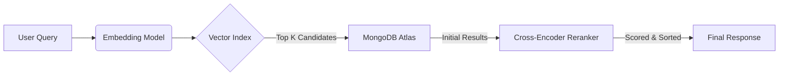

# 🥗 NutriPlan LLM Server


> **The Intelligent Brain behind NutriPlan.**
> A high-performance, context-aware AI backend orchestrating interactions between users, nutritional data, and Large Language Models.

---

## 🌟 Overview

The **NutriPlan LLM Server** is a sophisticated AI microservice built with **FastAPI**. It acts as the cognitive engine for the NutriPlan ecosystem, enabling:

*   **🗣️ Conversational Meal Planning**: A state-of-the-art chat agent that understands dietary constraints, preferences, and nutritional goals.
*   **🔍 Hybrid Search Engine**: Merging **Vector Search** (Semantic) with **Keyword Search** (Precision) to find the perfect food items.
*   **📚 Intelligent Manual Search**: RAG-based support system to answer user questions about the application itself.

🔗 **Live API Endpoint**: [https://star-terribly-sturgeon.ngrok-free.app/](https://star-terribly-sturgeon.ngrok-free.app/)

📄 **Interactive Docs**: [https://star-terribly-sturgeon.ngrok-free.app/docs](https://star-terribly-sturgeon.ngrok-free.app/docs)

---

## � Key Features

| Feature | Description |
| :--- | :--- |
| **RAG Architecture** | Retrieves real-time data from MongoDB Vector Stores to ground AI responses in fact, preventing hallucinations. |
| **Hybrid Search** | Combines `Vector Search` + `MongoDB Filters` + `Cross-Encoder Reranking` for top-tier relevance. |
| **Streaming API** | Full Server-Sent Events (SSE) support for ChatGPT-like real-time typing effects. |
| **Adaptive Logic** | Automatically switches between general chat fallback, specific tool execution, and database queries. |
| **Personalized Context** | Uses JWT-based authorization to tailor advice to the specific user's health profile. |

---

## 🏗️ System Architecture

### 🧠 The Core Pipeline (`CompleteMealPlannerPipeline`)
The central nervous system of the server. It manages the lifecycle of:
1.  **MealPlannerAgent**: The reasoning engine communicating with the LLM provider (vLLM/OpenAI).
2.  **FoodRAGPipeline**: The specialized search subsystem for nutritional data.
3.  **UserManualRAGPipeline**: The support subsystem for app documentation.

### 🔎 Search Strategy (The "Secret Sauce")
We don't just "search keywords". We understand *intent*.



1.  **Embed**: Query converted to 384-dimensional vector.
2.  **Retrieve**: Semantic match found in millions of records.
3.  **Filter**: Hard constraints (e.g., "Gluten-Free") applied immediately.
4.  **Rerank**: A second, more powerful model re-reads the top results to ensure the best one is first.

---

## 📂 Project Structure

```bash
llm-server/
├── 📄 llm_server.py           # 🚀 Entry Point: FastAPI App & Routes
├── 📄 .env.example            # 🔐 Config Template
├── 📦 requirements.txt        # 🐍 Dependencies
├── 📂 llm_agent/              # 🧠 Core Logic
│   ├── 📄 agent.py            #    - Agent Reasoning & State Management
│   ├── 📄 pipeline.py         #    - Master Orchestrator
│   ├── 📂 rag/                #    - Retrieval Augmented Generation
│   │   ├── 📄 food_rag.py     #      * Food Search Engine
│   │   └── 📄 manual_rag.py   #      * Documentation Search Engine
│   ├── 📂 tools/              #    - Functional Tools (API Calls)
│   └── 📂 utils/              #    - Helpers (Logging, Prompts)
└── 📂 dataset/                # 💾 Static Data Resources
```

---

## 🛠️ Installation & Setup

### Prerequisites
*   **Python 3.9+**
*   **MongoDB Atlas** (Required for Vector Search)
*   **ngrok** (For exposing server publically)

### 1. ☁️ MongoDB Atlas Setup (Critical)
This project relies on **Vector Search**, which requires a specific setup in MongoDB Atlas.

1.  **Create Cluster**: Go to [MongoDB Atlas](https://www.mongodb.com/cloud/atlas) and create a new free cluster.
2.  **Create Database**: Create a database named `nutriplan`.
    *   Collection 1: `foods` (Import your food data here).
    *   Collection 2: `llm_documents` (Import manual/help docs here).
3.  **Create Vector Search Index**:
    *   Navigate to the **Atlas Search** tab > **Vector Search**.
    *   Click **Create Search Index**.
    *   **JSON Editor** Configuration:
        ```json
        {
          "fields": [
            {
              "type": "vector",
              "path": "embedding",
              "numDimensions": 384,
              "similarity": "cosine"
            },
            {
              "type": "filter",
              "path": "nutrition.calories"
            },
            {
              "type": "filter",
              "path": "nutrition.proteins"
            },
            {
              "type": "filter",
              "path": "nutrition.carbs"
            },
            {
              "type": "filter",
              "path": "nutrition.fats"
            },
            {
              "type": "filter",
              "path": "property.isBreakfast"
            },
            {
              "type": "filter",
              "path": "property.isLunch"
            },
            {
              "type": "filter",
              "path": "property.isDinner"
            },
            {
              "type": "filter",
              "path": "property.isSnack"
            }
          ]
        }
        ```
    *   *Note: Ensure your data objects have an `embedding` field containing the vector array.*

### 2. 🐍 Local Installation
```bash
# Clone the repository
git clone <your-repo-url>
cd llm-server

# Virtual Env (Recommended)
python -m venv venv
source venv/bin/activate  # Windows: venv\Scripts\activate

# Install dependencies
pip install -r requirements.txt
```

### 3. 🌐 Expose Public API (Ngrok)
To allow the frontend or external services to access your local LLM server, you need to expose it.

1.  **Install ngrok**: [Download here](https://ngrok.com/download).
2.  **Start ngrok**:
    ```bash
    ngrok http 8000
    ```
3.  **Copy the URL**: You will get a forwarding URL like `https://star-terribly-sturgeon.ngrok-free.app`.
4.  **Update Config**: Use this URL in your frontend `.env` and this server's `.env` (if needed for callbacks).

### 4. 🏃 Run Server
```bash
uvicorn llm_server:app --host 0.0.0.0 --port 8000 --reload
```

---

## 📡 API Reference

Base URL: `https://star-terribly-sturgeon.ngrok-free.app`

### 💬 Chat
`POST /ai/chat`
Streamed conversation endpoint.
```json
// Request
{
  "messages": [{"role": "user", "content": "I need a keto dinner idea."}],
  "stream": true
}
```

### 🍎 Food Search
`POST /search/food`
Semantic search for ingredients/meals.
```json
// Request
{
  "query": "low carb pasta alternatives",
  "k": 5
}
```

### 📘 Manual Search
`POST /search/manual`
Find help topics.
```json
// Request
{
  "query": "how do I reset my password?",
  "k": 3
}
```
